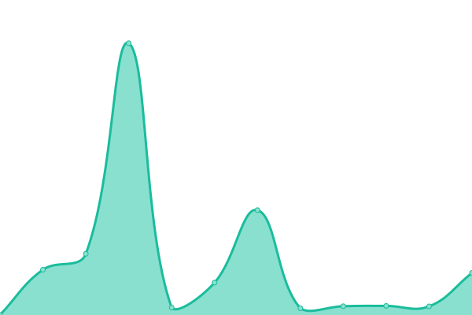

# [📈 Live Status](https://status.jrg.tools): <!--live status--> **🟩 All systems operational**

This repository contains the open-source uptime monitor and status page for [Jorge](https://whatisjorgedoing.today/), powered by [Upptime](https://github.com/upptime/upptime).

With [Upptime](https://upptime.js.org), you can get your own unlimited and free uptime monitor and status page, powered entirely by a GitHub repository. We use [Issues](https://github.com/jorgechato/status.jrg.tools/issues) as incident reports, [Actions](https://github.com/jorgechato/status.jrg.tools/actions) as uptime monitors, and [Pages](https://status.jrg.tools) for the status page.

<!--start: status pages-->
<!-- This summary is generated by Upptime (https://github.com/upptime/upptime) -->
<!-- Do not edit this manually, your changes will be overwritten -->
<!-- prettier-ignore -->
| URL | Status | History | Response Time | Uptime |
| --- | ------ | ------- | ------------- | ------ |
|  [Short URL](https://x.jrg.tools/list?size=0) | 🟩 Up | [short-url.yml](https://github.com/jorgechato/status.jrg.tools/commits/HEAD/history/short-url.yml) | 

 387ms
     
 | 

<a href="https://status.jrg.tools/history/short-url">100.00%</a>
    

|  [Where is jorge Today?](https://whereisjorge.today/) | 🟩 Up | [where-is-jorge-today.yml](https://github.com/jorgechato/status.jrg.tools/commits/HEAD/history/where-is-jorge-today.yml) | 

 253ms
     
 | 

<a href="https://status.jrg.tools/history/where-is-jorge-today">100.00%</a>
    

|  [Jorge Chato personal page](https://jorgechato.com/) | 🟩 Up | [jorge-chato-personal-page.yml](https://github.com/jorgechato/status.jrg.tools/commits/HEAD/history/jorge-chato-personal-page.yml) | 

 324ms
     
 | 

<a href="https://status.jrg.tools/history/jorge-chato-personal-page">100.00%</a>
    

<!--end: status pages-->

[**Visit our status website →**](https://status.jrg.tools)

## 📄 License

- Powered by: [Upptime](https://github.com/upptime/upptime)
- Code: [MIT](./LICENSE) © [Anand Chowdhary](https://anandchowdhary.com), supported by [Pabio](https://pabio.com)
- Data in the `./history` directory: [Open Database License](https://opendatacommons.org/licenses/odbl/1-0/)
